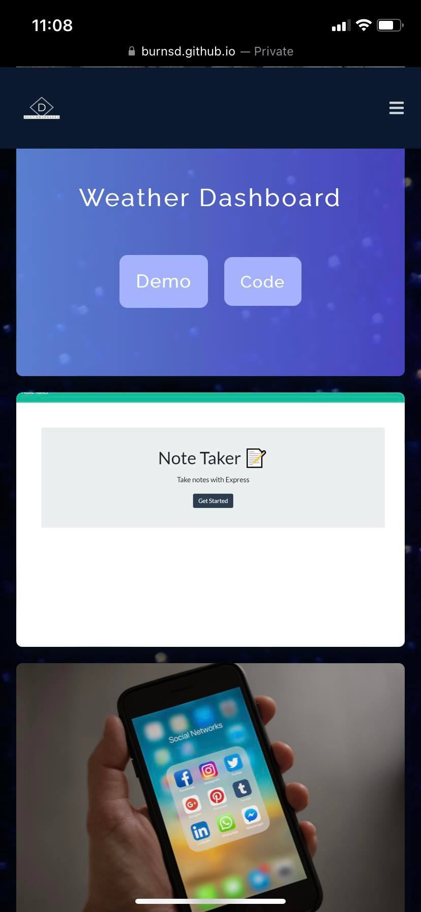
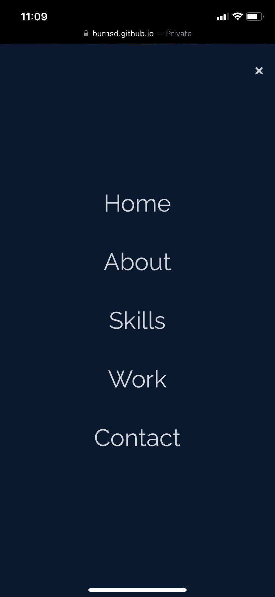

  # REACT Portfolio
  

  
  ## Table-of-Contents
  * [Description](#description)
  * [Usage](#usage)
  * [Contributing](#contributing)
  * [Questions](#questions)

[ISC](https://choosealicense.com/licenses/ISC)

 
  ## [Description](#table-of-contents)
  My Portfolio built using REACT and Tailwind CSS is meant to hold links to my recent projects as well as contact from to reach me. 
   

  ## [Installation](#table-of-contents)
  

  ## [Usage](#table-of-contents)
  Visit the website through this link ---> [DustinBurnsDev.com](https://burnsd.github.io/shiny-broccoli/)

  ## [License](#table-of-contents)
  This application has the following license:
  [ISC](https://choosealicense.com/licenses/ISC)
    
  ## [Questions](#table-of-contents)
  Contact me with any questions at the following:
  [GitHub](https://github.com/BurnsD)
  [Email: DustinBurnsDev@Gmail.com](mailto:DustinBurnsDev@Gmail.com)
  